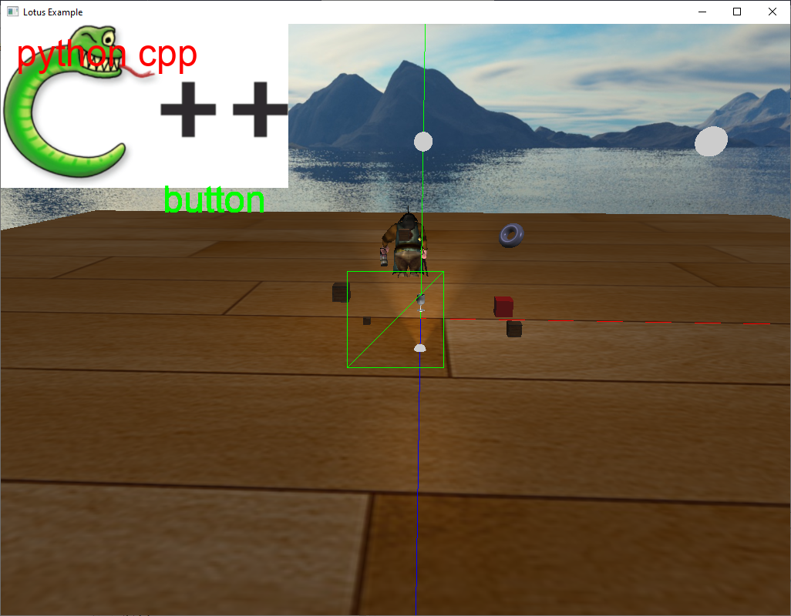

# LearnGL

## 简介

这里的代码是学习OpenGL和图形学而写的，后来某些原因学习中断了，只剩下的这些代码。

## 编译运行

1. 使用vcpkg安装依赖的库
   `.\vcpkg.exe install glfw3 glew freetype glm soil2 spdlog lua rapidxml`
2. 使用cmake生成工程编译
	`cmake -A win32 -DCMAKE_TOOLCHAIN_FILE="D:/devtools/vcpkg/scripts/buildsystems/vcpkg.cmake" path/to/src`
	这里cmake使用`-A win32`指定平台为win32，因为使用vcpkg安装的时候，默认是x86的。而Cmake默认是x64，所以这里指定为win32，不然cmake生成工程配置时会出错，找不到相关的依赖库。

## 关于版权

1. 代码库里面的data目录下的资源，收集于网络，使用的过程中可能会遇到版权问题。
2. 代码库里面有第三方的代码，它们并不属于本仓库，请注意它们的版权。

## 截图

